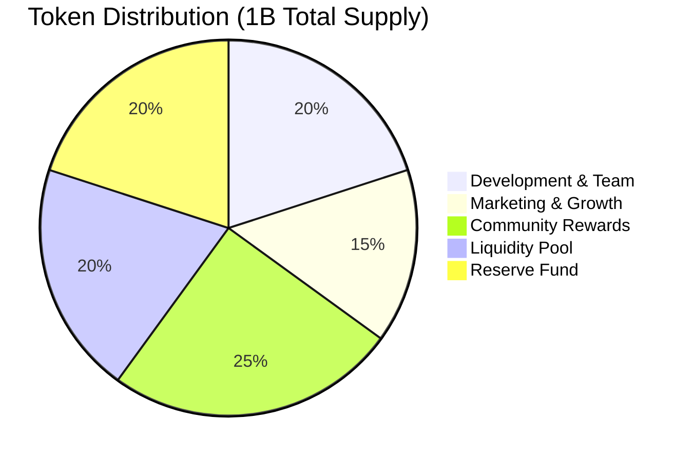
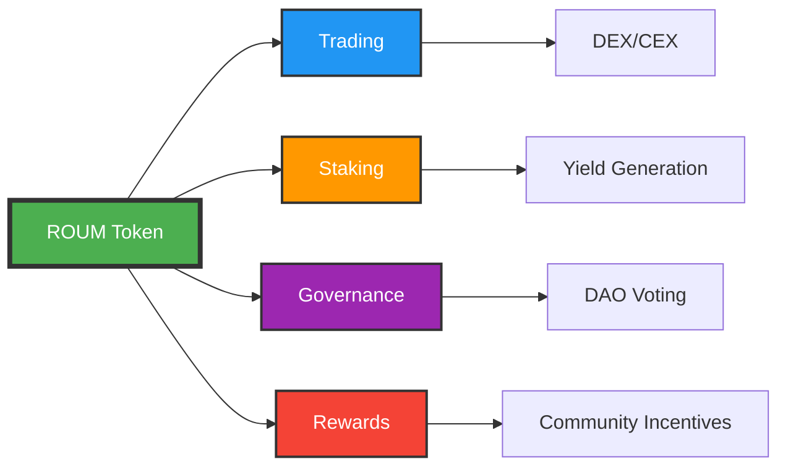
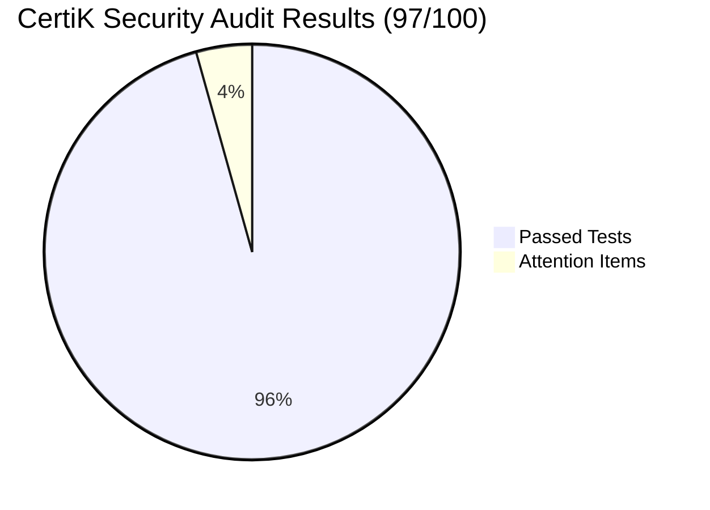
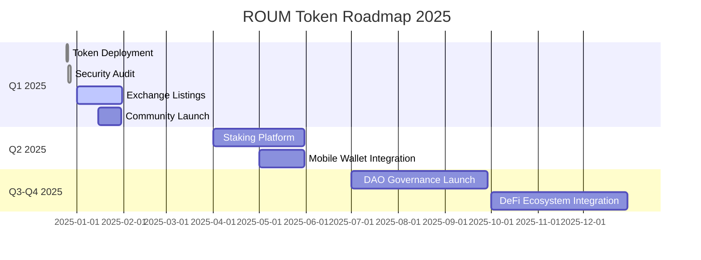

<div align="center">
  
  
  
  <h1>🪙 ROUM Token</h1>
  <p><strong>Rumeida Heritage on Binance Smart Chain</strong></p>
  
  <!-- CTA Button -->
  <a href="https://bscscan.com/address/0x35B1761B00AB98144fAB4dEDBD58C59A2050947e">
    
  </a>
  <a href="docs/CERTIK-AUDIT.md">
    
  </a>
  
  <br><br>
  
  [](LICENSE)
  [](https://soliditylang.org/)
  [](https://bscscan.com/address/0x35B1761B00AB98144fAB4dEDBD58C59A2050947e)
  [](https://sourcify.dev/#/lookup/0x35B1761B00AB98144fAB4dEDBD58C59A2050947e)
  [](docs/CERTIK-AUDIT.md)
  [](https://github.com/Osama-Qonaibe/ROUM-Token/actions/workflows/solidity-lint.yml)
  [](https://github.com/Osama-Qonaibe/ROUM-Token/actions/workflows/security-check.yml)

</div>

---

**ROUM** is a BEP-20 token deployed on Binance Smart Chain, representing the heritage and history of Rumeida (Tel Rumeida) in Hebron, Palestine.

## 📋 Token Information

| Property | Value |
|----------|-------|
| **Name** | Rumeida Heritage |
| **Symbol** | ROUM |
| **Network** | Binance Smart Chain (BSC) |
| **Contract** | `0x35B1761B00AB98144fAB4dEDBD58C59A2050947e` |
| **Total Supply** | 1,000,000,000 ROUM |
| **Decimals** | 18 |
| **License** | MIT |

## 📊 Tokenomics Overview

### Supply Distribution



### Token Allocation Breakdown

| Allocation | Tokens | Percentage | Purpose |
|-----------|--------|------------|----------|
| 🏗️ **Development & Team** | 200M | 20% | Team compensation, ongoing development |
| 📢 **Marketing & Growth** | 150M | 15% | Marketing campaigns, partnerships |
| 👥 **Community Rewards** | 250M | 25% | Airdrops, staking rewards, incentives |
| 💧 **Liquidity Pool** | 200M | 20% | DEX liquidity provision |
| 🏦 **Reserve Fund** | 200M | 20% | Emergency fund, future expansion |
| **Total** | **1,000M** | **100%** | |

### Token Utility Flow



### Security Score Breakdown



**Audit Details:**
- ✅ 22 Tests Passed (95.7%)
- 🟡 1 Attention Item (Token Distribution - Pre-launch)
- ⚠️ 0 Critical Issues
- 🔴 0 High Risk Items

### Development Roadmap



## 🔗 Quick Links

- 🔍 [**BSCScan**](https://bscscan.com/address/0x35B1761B00AB98144fAB4dEDBD58C59A2050947e) - View on Block Explorer
- ✅ [**Sourcify**](https://repo.sourcify.dev/contracts/full_match/56/0x35B1761B00AB98144fAB4dEDBD58C59A2050947e/) - Verified Source Code
- 🔐 [**CertiK Security Audit**](docs/CERTIK-AUDIT.md) - Comprehensive Audit Report (97/100)
- 🔍 [**CertiK Skynet Scan**](https://skynet.certik.com/tools/token-scan/bsc/0x35B1761B00AB98144fAB4dEDBD58C59A2050947e) - Live Security Scanner
- 📚 [**Documentation**](docs/) - Technical Documentation
- 🎨 [**Brand Assets**](assets/) - Logos and Brand Guidelines

## ✨ Features

- ✅ **Full ERC-20/BEP-20 Compatibility** - Standard compliant token
- ✅ **Optimized Gas Usage** - Built with Solidity 0.8.33
- ✅ **Fully Decentralized** - No owner, immutable contract
- ✅ **Built-in Overflow Protection** - Safe math included
- ✅ **Clean & Auditable Code** - Open source and transparent
- ✅ **Multiple Verifications** - Verified on BSCScan and Sourcify
- ✅ **Security Audited** - CertiK Score: 97/100 (Excellent)

## 🛠️ Technical Details

### Compiler Configuration

```json
{
  "compiler": "solc 0.8.33+commit.64118f21",
  "optimizer": {
    "enabled": true,
    "runs": 200
  },
  "evmVersion": "cancun"
}
```

### Core Functions

<details>
<summary><strong>Standard ERC-20 Functions</strong></summary>

- `name()` - Returns token name
- `symbol()` - Returns token symbol  
- `decimals()` - Returns decimal places (18)
- `totalSupply()` - Returns total token supply
- `balanceOf(address)` - Returns balance of address
- `transfer(address, uint256)` - Transfer tokens
- `approve(address, uint256)` - Approve spending allowance
- `allowance(address, address)` - Check approved allowance
- `transferFrom(address, address, uint256)` - Transfer from approved address

</details>

<details>
<summary><strong>Enhanced Functions</strong></summary>

- `increaseAllowance(address, uint256)` - Safely increase allowance
- `decreaseAllowance(address, uint256)` - Safely decrease allowance

</details>

## 📦 Repository Structure

```
ROUM-Token/
├── .github/                  # GitHub configuration
│   ├── FUNDING.yml
│   ├── ISSUE_TEMPLATE/
│   ├── workflows/
│   │   ├── solidity-lint.yml
│   │   └── security-check.yml
│   └── PULL_REQUEST_TEMPLATE.md
├── assets/                  # Brand assets and logos
│   ├── logos/              # Logo files directory
│   ├── audit/              # Security audit visualizations
│   ├── README.md
│   └── brand-guidelines.md
├── build/                   # Compilation artifacts
│   ├── abi.json
│   ├── metadata.json
│   └── compiler-settings.json
├── contracts/               # Solidity source code
│   └── ROUM.sol
├── docs/                    # Documentation
│   ├── CERTIK-AUDIT.md
│   ├── DEPLOYMENT.md
│   ├── SECURITY.md
│   └── INTEGRATION.md
├── .solhint.json           # Solidity linter config
├── package.json            # NPM configuration
├── package-lock.json       # NPM lock file
├── LICENSE                 # MIT License
├── README.md               # This file
└── .gitignore
```

## 🚀 Deployment Info

- **Network:** BSC Mainnet (Chain ID: 56)
- **Deployed:** 25 December 2024
- **Developer:** Osama Qonaibe
- **Verification:** Full Match on Sourcify
- **Source Hash:** `0x6526bb915825c7ff9ef0b43ad126ccd5075553b3b6a996053665961853893afd`
- **IPFS:** `QmZnz3iQxZL61Hm5W5YZFySENDMLeyXo86TLa5dHsVpPmL`

## 🔧 Development

### Setup

```bash
# Clone repository
git clone https://github.com/Osama-Qonaibe/ROUM-Token.git
cd ROUM-Token

# Install dependencies
npm install

# Run linter
npm run lint

# Fix linting issues
npm run lint:fix
```

### GitHub Actions

This repository uses automated workflows: 

- **Solidity Lint** - Checks code quality on every push/PR
- **Smart Contract Security** - Generates security reports automatically

## 👨‍💻 Developer

**Osama Qonaibe**  
📧 Email: Osamaqonaibe@outlook.com  
🌍 Location: Palestine 🇵🇸  
💼 Role: Full-Stack & Blockchain Developer

## 📚 Documentation

| Document | Description |
|----------|-------------|
| [🔐 CertiK Audit Report](docs/CERTIK-AUDIT.md) | **Comprehensive security audit with charts (97/100)** |
| [Security Features](docs/SECURITY.md) | Security features and best practices |
| [Integration Guide](docs/INTEGRATION.md) | Developer integration with code examples |
| [Deployment Info](docs/DEPLOYMENT.md) | Deployment details and verification |
| [Brand Guidelines](assets/brand-guidelines.md) | Logo usage and brand standards |

## 📜 License

This project is licensed under the **MIT License**. 

```
MIT License

Copyright (c) 2025 Osama Qonaibe

Permission is hereby granted, free of charge, to any person obtaining a copy
of this software and associated documentation files (the "Software"), to deal
in the Software without restriction, including without limitation the rights
to use, copy, modify, merge, publish, distribute, sublicense, and/or sell
copies of the Software, and to permit persons to whom the Software is
furnished to do so, subject to the following conditions:

The above copyright notice and this permission notice shall be included in all
copies or substantial portions of the Software.

THE SOFTWARE IS PROVIDED "AS IS", WITHOUT WARRANTY OF ANY KIND, EXPRESS OR
IMPLIED, INCLUDING BUT NOT LIMITED TO THE WARRANTIES OF MERCHANTABILITY,
FITNESS FOR A PARTICULAR PURPOSE AND NONINFRINGEMENT. IN NO EVENT SHALL THE
AUTHORS OR COPYRIGHT HOLDERS BE LIABLE FOR ANY CLAIM, DAMAGES OR OTHER
LIABILITY, WHETHER IN AN ACTION OF CONTRACT, TORT OR OTHERWISE, ARISING FROM,
OUT OF OR IN CONNECTION WITH THE SOFTWARE OR THE USE OR OTHER DEALINGS IN THE
SOFTWARE.
```

## 🔐 Security

### Security Audit Summary

**CertiK Security Score: 97/100** ⭐⭐⭐⭐⭐

- ✅ **22/23 Tests Passed** (95.7%)
- 🟡 **1 Attention Item** (Token Distribution - Pre-launch)
- ⚠️ **0 Critical Issues**
- 🔴 **0 High Risk Items**

[**📄 View Full Audit Report**](docs/CERTIK-AUDIT.md) | [**🔍 CertiK Live Scanner**](https://skynet.certik.com/tools/token-scan/bsc/0x35B1761B00AB98144fAB4dEDBD58C59A2050947e)

### Security Features

- ✅ Verified on Sourcify (Full Match)
- ✅ Verified on BSCScan  
- ✅ Solidity 0.8.33 (built-in overflow protection)
- ✅ No external dependencies
- ✅ Immutable (no owner controls)
- ✅ Open source (MIT License)
- ✅ Automated smart contract security checks
- ✅ Automated code quality validation (Solhint)
- ✅ **CertiK Audited (97/100)** - Exceptional Rating

🚨 **Security Contact:** Osamaqonaibe@outlook.com

For detailed security information, see [SECURITY.md](docs/SECURITY.md)

## 🌟 About Tel Rumeida

Tel Rumeida (Arabic: تل الرميدة) is an ancient archaeological site in Hebron, Palestine, with continuous human settlement spanning over 5,000 years. This token honors and preserves the rich cultural heritage of this historic Palestinian site.

## 🤝 Contributing

Contributions are welcome! Please feel free to submit issues or pull requests.

**Before contributing:**
1. Check existing issues
2. Follow the code style guidelines
3. Write clear commit messages
4. Test your changes on BSC testnet
5. Ensure all linting checks pass

## 💬 Support

**Need help?**
- 📧 Email: Osamaqonaibe@outlook.com
- 🐛 GitHub Issues: [Create an issue](https://github.com/Osama-Qonaibe/ROUM-Token/issues)
- 📖 Documentation: [View docs](docs/)

---

<div align="center">
  
  ### Made with ❤️ in Palestine 🇵🇸
  
  <br>
  
  <a href="https://bscscan.com/address/0x35B1761B00AB98144fAB4dEDBD58C59A2050947e">BSCScan</a> •
  <a href="https://repo.sourcify.dev/contracts/full_match/56/0x35B1761B00AB98144fAB4dEDBD58C59A2050947e/">Sourcify</a> •
  <a href="docs/CERTIK-AUDIT.md">Security Audit</a> •
  <a href="https://github.com/Osama-Qonaibe/ROUM-Token">GitHub</a>
  
  <br><br>
  
  **ROUM Token - Preserving Palestinian Heritage on the Blockchain**
  
</div>